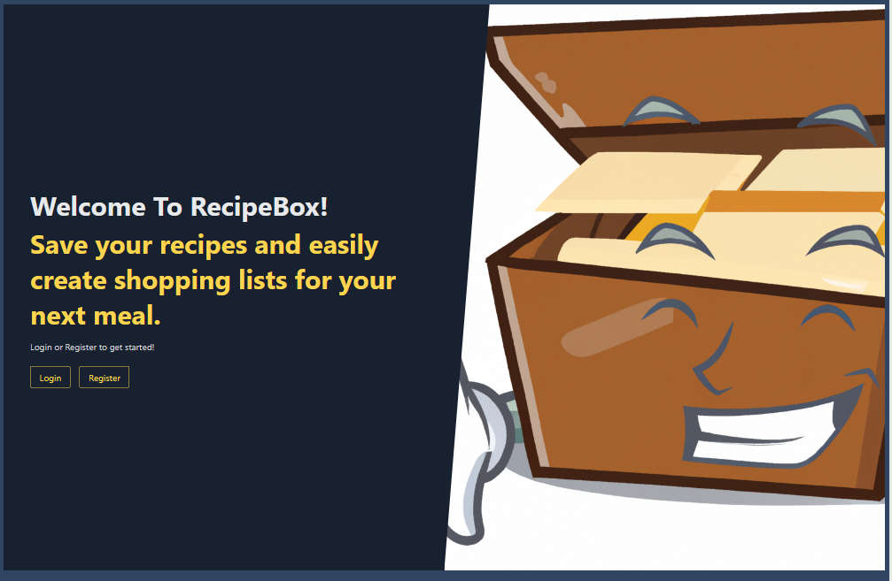
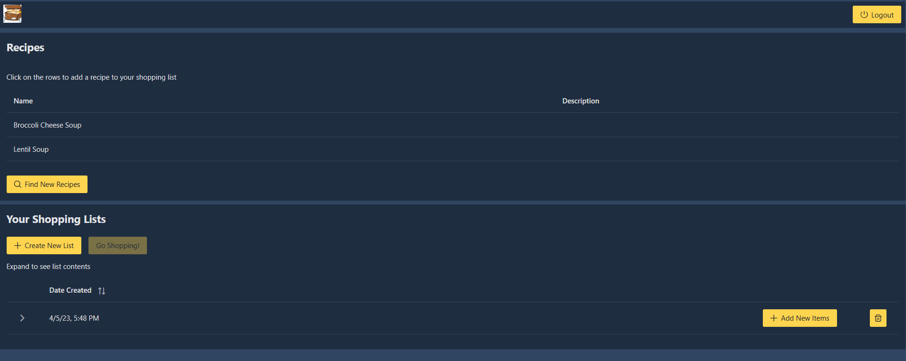
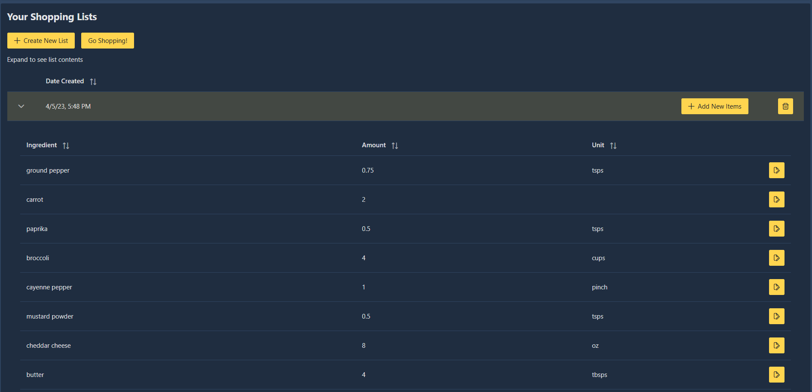
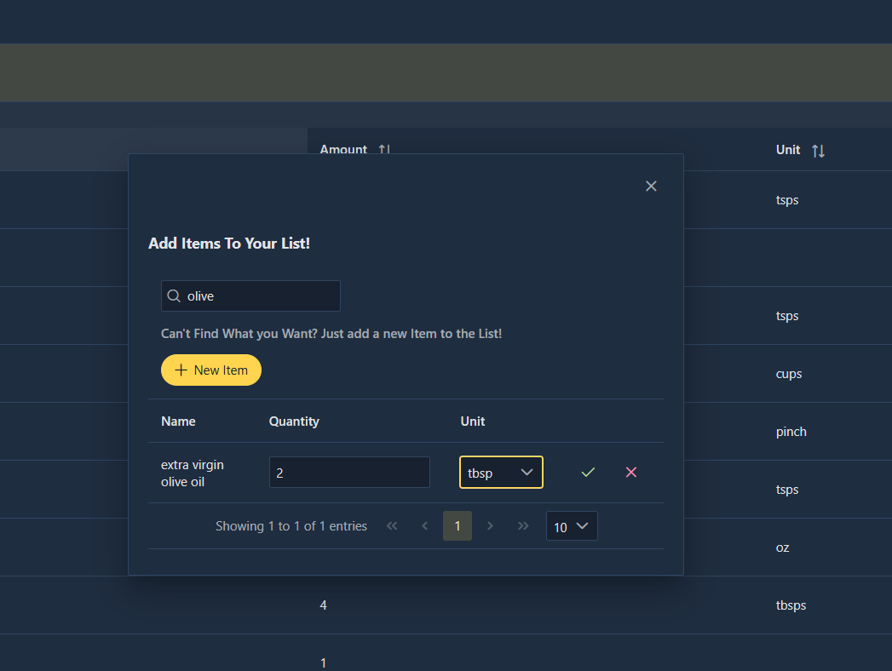
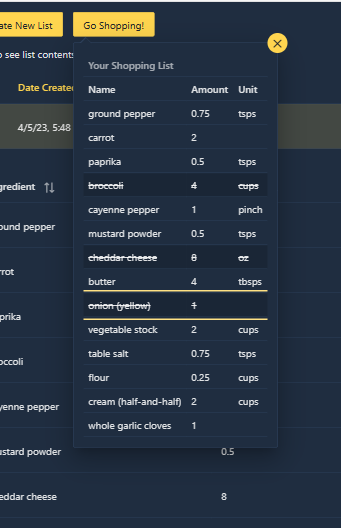
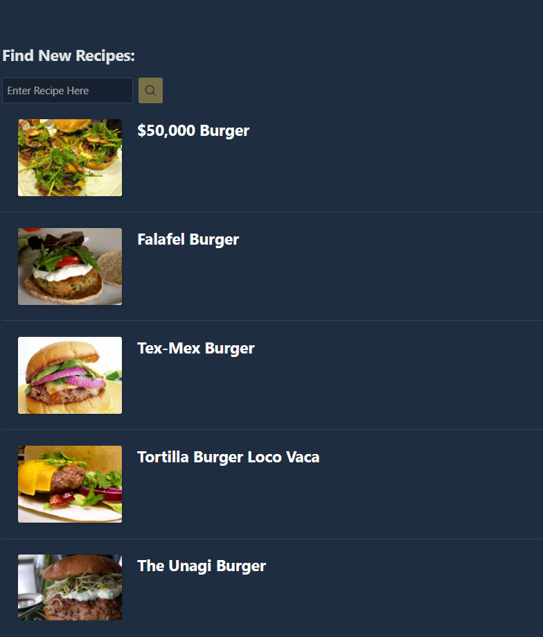

# recipebox

## About

Welcome to Recipebox! The application that allows you to create shopping lists by adding individual items, or simply add this weeks recipes to your list. Recipebox itemizes your recipes and allows you to customize any list. Access the web application from your phone, click on Go Shopping, and you are provided with an interactive shopping list, simply click the items as you place them in your cart in real time. Showing up prepared to shop is the ideal way to save money at the grocery store. Recipebox makes it simple and easy to create a list you would otherwise have to search through your recipe cards and write down. 

## Stack

Recipebox uses Angular with Primeng styling for the front end. The back end uses NodeJS with Express and MySQL to persist your data. The backend also utilizes the Spoonacular API to search and save new and exciting recipes. 

In the future, I am hoping to utilize deep learning and visual image classification to scan and save your personal recipes sitting at home so you can enjoy them and others!

## How It Works

Simply login or register to start. The application will then take you to your own personal profile page. Here is where you can view your recipes, create/remove shopping lists, and much more!

To add a recipe to your shopping list, simply click on the recipe table row and accept the confirmation. The recipe contents are added to the list. 

All the items in the list are customizable, need more or less, just click on the edit button and adjust to your liking. But what if you want a different item? No problem, click on the Add Item button. This provides a searchable overlay with all items existing in the database, simply click on the item you want, and customize the quantity and units. And if theres a item you cant find, you can easily add one to the list. 

Then when you are ready to go shopping, you can easily access your profile page from your mobile device. Click on the list you want, and you are provided with a handy interactive list, that allows you to cross off items as you put them in your cart in real time. 

Theres even some new features, with more to come! Using the spoonacular API, you can search for new recipes. Save the recipe and add it to your next list!

